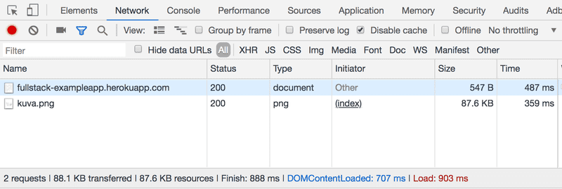

# Full Stack Javascript

_Este proyecto sirve como una introducción al desarrollo moderno de aplicacion web con JavaScript, donde el foco principal esta puesto en construir SPAs (single page applications) con ReactJS que utilicen APIs REST construidas con Node.js. En este proyecto tambien se agregará una sección sobre GraphQL, una alternativa moderna a APIs REST._

_Se cubrirá algo de testing, configuración y manejo de entorno, y el uso de MongoDB para persistir los datos de la aplicación._

## Indice:

**Parte 0: Fundametos de las aplicaciones Webs**
1. [Fundamentos de las aplicaciones Web](#fundamentos-apps-web)

## Parte 0: Fundamentos de las aplicaciones Web

_En esta parte se desarrollarán los conceptos basicos del desarrollo web y se hablara de como evolucionó el desarrollo de aplicaciones web en las últimas décadas._

### Fundamentos de las aplicaciones Web

_A continuación podremos observar unas imágenes en las que servirán para demostrar conceptos básicos pero que no quieren decir que sean ejemplos de como las aplicaciones Web deben ser. Por el contrario, muestran viejas tecnicas de desarrollo web que pueden considerarse_ **malas practicas** _hoy en día._

_Durante todo el proyecto se estará utilizando el navegador Chrome._

**_La primera regla del desarrollo Web:_** _Siempre tener a la vista la Consola de Desarrollo abierta en tu navegador. En macOS, la consola se abre presionando `F12` o `option-cmd-i` simultaneamente. En Windows o Linux, la consola se abre presionando `F12` o `ctrl-shift-i` simultaneamente._

_La consola se ve de la siguiente manera:_

_Es recomendable,en la pestaña Network, tener marcada la opcion de deshabilitar el cache (Disable cache) como se muestra en la imagen, ya que de no hacerlo es muy probable que no veamos los cambios que realicemos a nuestro código. Preservar el log (Preserve log) puede ser muy util ya que guarda los logs ya mostrados por la aplicacion cuando la página es recargada._

**Nota:** _La pestaña mas importante es la **Consola**. Sin embargo, en esta introducción se estará utilizando bastante la pestaña **Network**._

#### HTTP GET

_El servidor y el navegador web se comunican uno con el otro mediante el protocolo [HTTP](https://developer.mozilla.org/en-US/docs/Web/HTTP). La pestaña Network muestra como se comunican el navegador y el servidor._

_Cuando la pagina es recargada (presionando `F5` o en el simbolo ↺ del navegador), la consola muestra que dos eventos han sucedido:_

* _El navegador recupera (fetch) el contenido de la pagina fullstack-exampleapp.herokuapp.com del servidor._

* _Y descarga la imagen kuva.png_

_En una pantalla pequeña puede que se deba ampliar la ventana de la consola para verlo._

_Clickeando en el primer evento hará que se nos muestre mas informacioón sobre lo que está sucediendo.:_

