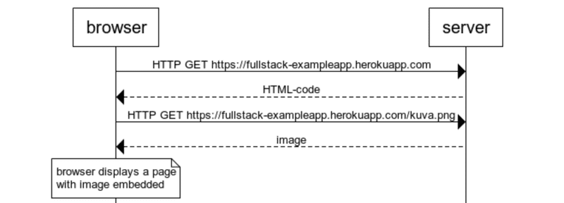

# Full Stack Javascript

_Este proyecto sirve como una introducción al desarrollo moderno de aplicacion web con JavaScript, donde el foco principal esta puesto en construir SPAs (single page applications) con ReactJS que utilicen APIs REST construidas con Node.js. En este proyecto tambien se agregará una sección sobre GraphQL, una alternativa moderna a APIs REST._

_Se cubrirá algo de testing, configuración y manejo de entorno, y el uso de MongoDB para persistir los datos de la aplicación._

## Indice:

**Parte 0: Fundametos de las aplicaciones Webs**
1. [Fundamentos de las aplicaciones Web](#fundamentos-de-las-aplicaciones-web)
    * [HTTP GET](#http-get)
    * [Aplicaciones web tradicionales](#aplicaciones-web-tradicionales)

## Parte 0: Fundamentos de las aplicaciones Web

_En esta parte se desarrollarán los conceptos basicos del desarrollo web y se hablará de como evolucionó el desarrollo de aplicaciones web en las últimas décadas._

### Fundamentos de las aplicaciones Web

_A continuación podremos observar unas imágenes en las que servirán para demostrar conceptos básicos pero que no quieren decir que sean ejemplos de como las aplicaciones Web deben ser. Por el contrario, muestran viejas tecnicas de desarrollo web que pueden considerarse_ **malas practicas** _hoy en día._

_Durante todo el proyecto se estará utilizando el navegador Chrome._

**_La primera regla del desarrollo Web:_** _Siempre tener a la vista la Consola de Desarrollo abierta en tu navegador. En macOS, la consola se abre presionando `F12` o `option-cmd-i` simultaneamente. En Windows o Linux, la consola se abre presionando `F12` o `ctrl-shift-i` simultaneamente._

_La consola se ve de la siguiente manera:_

_Es recomendable,en la pestaña Network, tener marcada la opcion de deshabilitar el cache (Disable cache) como se muestra en la imagen, ya que de no hacerlo es muy probable que no veamos los cambios que realicemos a nuestro código. Preservar el log (Preserve log) puede ser muy util ya que guarda los logs ya mostrados por la aplicacion cuando la página es recargada._

**Nota:** _La pestaña mas importante es la **Consola**. Sin embargo, en esta introducción se estará utilizando bastante la pestaña **Network**._

#### HTTP GET

_El servidor y el navegador web se comunican uno con el otro mediante el protocolo [HTTP](https://developer.mozilla.org/en-US/docs/Web/HTTP). La pestaña Network muestra como se comunican el navegador y el servidor._

_Cuando la pagina es recargada (presionando `F5` o en el simbolo ↺ del navegador), la consola muestra que dos eventos han sucedido:_

* _El navegador recupera (fetch) el contenido de la pagina fullstack-exampleapp.herokuapp.com del servidor._

* _Y descarga la imagen kuva.png_

_En una pantalla pequeña puede que se deba ampliar la ventana de la consola para verlo._

_Clickeando en el primer evento hará que se nos muestre mas informacioón sobre lo que está sucediendo.:_

_La parte de arriba, General, muestra que el navegador hizo una petición (request) a la dirección https://fullstack-exampleapp.herokuapp.com usando el método GET, y que la petición fue exitosa, porque la respuesta del servidor tiene un [Status code](https://en.wikipedia.org/wiki/List_of_HTTP_status_codes) **200**._

_La petición y la respuesta del servidor tiene varios encabezados (headers):_

_Los response headers (encabezados de la respuesta) nos dicen, por ejemplo, el tamaño de la respuesta en bytes, y el tiempo exacto de la respuesta. Un encabezado importante es el [Content-Type](https://developer.mozilla.org/en-US/docs/Web/HTTP/Headers/Content-Type) que nos dice que la respuesta es un archivo de texto en formato [utf-8](https://en.wikipedia.org/wiki/UTF-8), cuyo contenido ha sido formateado en HTML. De esta manera el navegador sabe que la respuesta es una pagina [HTML](https://en.wikipedia.org/wiki/HTML), y que debe renderizarlo en el navegador 'como una pagina web'._

_La pestaña Response (respuesta) muestra los datos de la respuesta, una página HTML normal. La sección **body** determina la estructura de la página renderizada en la pantalla:_

_La página contiene un elemento [div](https://developer.mozilla.org/en-US/docs/Web/HTML/Element/div), que dentro contiene un heading (encabezado), un link a una página notes, y un tag [img](https://developer.mozilla.org/en-US/docs/Web/HTML/Element/img), y muestra el número de notas creadas._

_Debido al tag img, el navegador realiza una segunda petición HTTP para recuperar la imagen kuva.png de el servidor. El detalle de la petición es el siguiente:_

_La petición se realizó a la dirección https://fullstack-exampleapp.herokuapp.com/kuva.png y su tipo es HTTP GET. El encabezado de la respuesta nos dice que el tamaño de la respuesta es de 89350 bytes, y su [Content-Type](https://developer.mozilla.org/en-US/docs/Web/HTTP/Headers/Content-Type) es image/png, asi que es una imagen png. El navegador usa esta información para renderizar la imagen correctamente en la pantalla._

_La cadena de eventos causada por abrir la página https://fullstack-exampleapp.herokuapp.com en el navegador genera el siguiente [diagrama de secuencia](https://www.geeksforgeeks.org/unified-modeling-language-uml-sequence-diagrams/):_

_Primero, el navegador hace una solicitud HTTP GET al servidor para recuperar el codigo HTML de la pagina. El tag img en el HMTL le indica al navegador que debe recuperar la imagen kuva.png. El navegador renderiza la pagina HTML y la imagen en la pantalla._

_Aunque es dificil de notar, la página HTML comienza a renderizarse antes de que la imagen sea recuperada del servidor._

#### Aplicaciones web tradicionales

_La página de inicio de la aplicacion de ejemplo funciona como una aplicacion web tradicional. Cuando uno entra a la página, el navegador recupera el documento HTML detallando la estructura y el contenido textual de la página desde el servidor._

_El servidor ha formateado el documento de alguna manera. El documento puede ser una archivo de texto guardado en el directorio del servidor. El servidor tambien puede formar el documento HTML **dinamicamente** según el codigo de la aplicación, utilizando por ejemplo, datos de una base de datos. El codigo HTML de la aplicación de ejemplo ha sido formado dinamicamente, porque este contiene informacion sobre el número de notas creadas._

_El codigo HTML de la pagina de inicio es el siguiente:_

~~~
const getFrontPageHtml = (noteCount) => {
  return(`
    <!DOCTYPE html>
    <html>
      <head>
      </head>
      <body>
        

          <h1>Full stack example app</h1>
          
number of notes created ${noteCount}

          <a href='/notes'>notes</a>
          
        

      </body>
    </html>
`)
} 

app.get('/', (req, res) => {
  const page = getFrontPageHtml(notes.length)
  res.send(page)
})
~~~

_No es necesario entender el código todavía._

_El contenido de la pagina HTML ha sido guardado como un **template string**, o un string (cadena de texto) que permite, por ejemplo, evaluar variables dentro de ella. La parte de la página de inicio que cambia dinamicamente, el numero de notas guardadas (en el codigo `noteCount`), es remplazado por el numero actual de notas (en el codigo `notes.length`) en el template string._

_En una aplicación web tradicional el navegador es un poco "tonto". Solo recupera el HTML del servidor, y toda la logica de la aplicación esta en el servidor. Un servidor puede ser creado, por ejemplo, usando Java Spring, Python Flask o con Ruby on Rails._

_En este curso se utilizará Node.js y su framework Express para crear un servidor web._

