## Parte 0: Fundamentos de las aplicaciones Web

_En esta parte se desarrollarán los conceptos basicos del desarrollo web y se hablará de como evolucionó el desarrollo de aplicaciones web en las últimas décadas._

### 🔹🔹🔹 Fundamentos de las aplicaciones Web 🔹🔹🔹

_A continuación podremos observar unas imágenes que servirán para demostrar conceptos básicos pero que no quieren decir que sean ejemplos de como las aplicaciones Web deben ser. Por el contrario, muestran viejas tecnicas de desarrollo web que pueden considerarse_ **malas practicas** _hoy en día._

_Durante todo el curso se estará utilizando el navegador Chrome._

**_La primera regla del desarrollo Web:_** _Siempre tener a la vista la Consola de Desarrollo abierta en tu navegador. En macOS, la consola se abre presionando `F12` o `option-cmd-i` simultaneamente. En Windows o Linux, la consola se abre presionando `F12` o `ctrl-shift-i` simultaneamente._

_La consola se ve de la siguiente manera:_

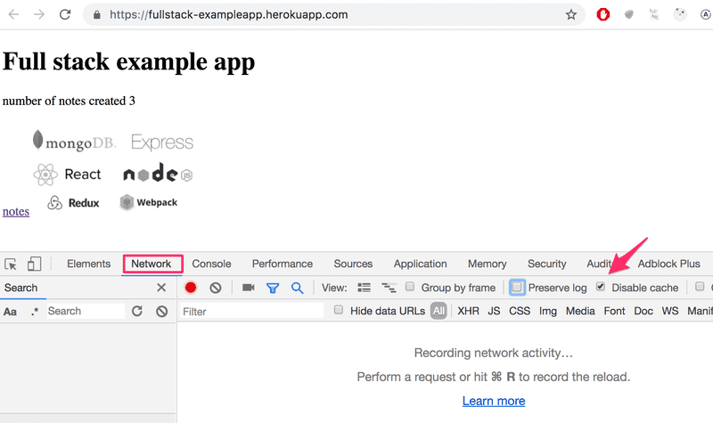

_Es recomendable,en la pestaña Network, tener marcada la opcion de deshabilitar el cache (Disable cache) como se muestra en la imagen, ya que de no hacerlo es muy probable que no veamos los cambios que realicemos a nuestro código. Preservar el log (Preserve log) puede ser muy util ya que guarda los logs ya mostrados por la aplicacion cuando la página es recargada._

**Nota:** _La pestaña mas importante es la **Consola**. Sin embargo, en esta introducción se estará utilizando bastante la pestaña **Network**._

#### 🔹🔹🔹 HTTP GET 🔹🔹🔹

_El servidor y el navegador web se comunican uno con el otro mediante el protocolo [HTTP](https://developer.mozilla.org/en-US/docs/Web/HTTP). La pestaña Network muestra como se comunican el navegador y el servidor._

_Cuando la pagina es recargada (presionando `F5` o en el simbolo ↺ del navegador), la consola muestra que dos eventos han sucedido:_

* _El navegador recupera (fetch) el contenido de la pagina fullstack-exampleapp.herokuapp.com del servidor._

* _Y descarga la imagen kuva.png_

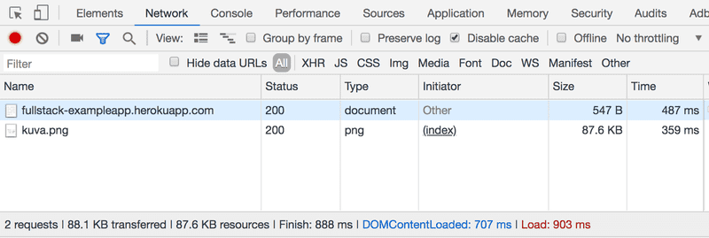

_En una pantalla pequeña puede que se deba ampliar la ventana de la consola para verlo._

_Clickeando en el primer evento hará que se nos muestre mas informacioón sobre lo que está sucediendo.:_

_La parte de arriba, General, muestra que el navegador hizo una petición (request) a la dirección https://fullstack-exampleapp.herokuapp.com usando el método GET, y que la petición fue exitosa, porque la respuesta del servidor tiene un [Status code](https://en.wikipedia.org/wiki/List_of_HTTP_status_codes) **200**._

_La petición y la respuesta del servidor tiene varios encabezados (headers):_

_Los response headers (encabezados de la respuesta) nos dicen, por ejemplo, el tamaño de la respuesta en bytes, y el tiempo exacto de la respuesta. Un encabezado importante es el [Content-Type](https://developer.mozilla.org/en-US/docs/Web/HTTP/Headers/Content-Type) que nos dice que la respuesta es un archivo de texto en formato [utf-8](https://en.wikipedia.org/wiki/UTF-8), cuyo contenido ha sido formateado en HTML. De esta manera el navegador sabe que la respuesta es una pagina [HTML](https://en.wikipedia.org/wiki/HTML), y que debe renderizarlo en el navegador 'como una pagina web'._

_La pestaña Response (respuesta) muestra los datos de la respuesta, una página HTML normal. La sección **body** determina la estructura de la página renderizada en la pantalla:_

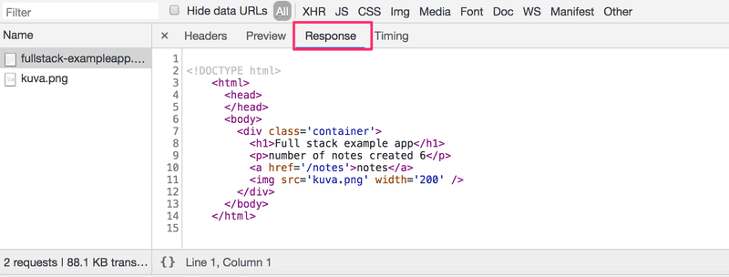

_La página contiene un elemento [div](https://developer.mozilla.org/en-US/docs/Web/HTML/Element/div), que dentro contiene un heading (encabezado), un link a una página notes, y un tag [img](https://developer.mozilla.org/en-US/docs/Web/HTML/Element/img), y muestra el número de notas creadas._

_Debido al tag img, el navegador realiza una segunda petición HTTP para recuperar la imagen kuva.png de el servidor. El detalle de la petición es el siguiente:_

_La petición se realizó a la dirección https://fullstack-exampleapp.herokuapp.com/kuva.png y su tipo es HTTP GET. El encabezado de la respuesta nos dice que el tamaño de la respuesta es de 89350 bytes, y su [Content-Type](https://developer.mozilla.org/en-US/docs/Web/HTTP/Headers/Content-Type) es image/png, asi que es una imagen png. El navegador usa esta información para renderizar la imagen correctamente en la pantalla._

_La cadena de eventos causada por abrir la página https://fullstack-exampleapp.herokuapp.com en el navegador genera el siguiente [diagrama de secuencia](https://www.geeksforgeeks.org/unified-modeling-language-uml-sequence-diagrams/):_

_Primero, el navegador hace una solicitud HTTP GET al servidor para recuperar el codigo HTML de la pagina. El tag img en el HMTL le indica al navegador que debe recuperar la imagen kuva.png. El navegador renderiza la pagina HTML y la imagen en la pantalla._

_Aunque es dificil de notar, la página HTML comienza a renderizarse antes de que la imagen sea recuperada del servidor._

#### 🔹🔹🔹 Aplicaciones web tradicionales 🔹🔹🔹

_La página de inicio de la aplicacion de ejemplo funciona como una aplicacion web tradicional. Cuando uno entra a la página, el navegador recupera el documento HTML detallando la estructura y el contenido textual de la página desde el servidor._

_El servidor ha formateado el documento de alguna manera. El documento puede ser una archivo de texto guardado en el directorio del servidor. El servidor tambien puede formar el documento HTML **dinamicamente** según el codigo de la aplicación, utilizando por ejemplo, datos de una base de datos. El codigo HTML de la aplicación de ejemplo ha sido formado dinamicamente, porque este contiene informacion sobre el número de notas creadas._

_El codigo HTML de la pagina de inicio es el siguiente:_

~~~
const getFrontPageHtml = (noteCount) => {
  return(`
    <!DOCTYPE html>
    <html>
      <head>
      </head>
      <body>
        

          <h1>Full stack example app</h1>
          
number of notes created ${noteCount}

          <a href='/notes'>notes</a>
          
        

      </body>
    </html>
`)
} 

app.get('/', (req, res) => {
  const page = getFrontPageHtml(notes.length)
  res.send(page)
})
~~~

_No es necesario entender el código todavía._

_El contenido de la página HTML ha sido guardado como un **template string**, o un string (cadena de texto) que permite, por ejemplo, evaluar variables dentro de ella. La parte de la página de inicio que cambia dinámicamente, el número de notas guardadas (en el código `noteCount`), es remplazado por el número actual de notas (en el código `notes.length`) en el template string._

_En una aplicación web tradicional el navegador es un poco "tonto". Solo recupera el HTML del servidor, y toda la lógica de la aplicación esta en el servidor. Un servidor puede ser creado, por ejemplo, usando Java Spring, Python Flask o con Ruby on Rails._

_En este curso se utilizará Node.js y su framework Express para crear un servidor web._

#### 🔹🔹🔹 La lógica de la aplicación corriendo en el navegador 🔹🔹🔹

_La siguiente imagen corresponde a la página notes, el navegador realiza cuatro solicitudes HTTP:_

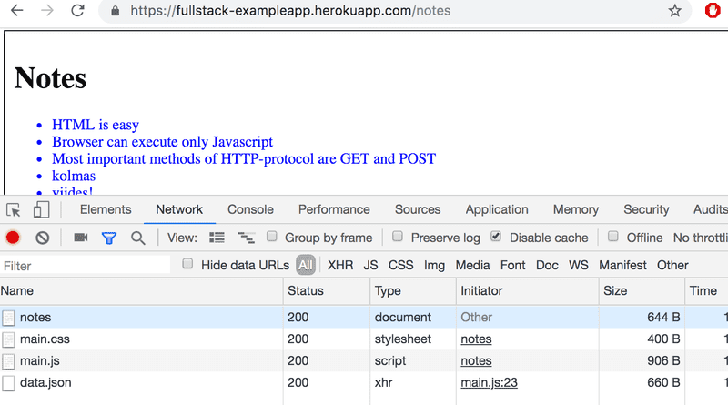

_Todas las solicitudes tienen **diferentes tipos**. El tipo de la primer solicitud es **document**. Es el codigo HTML de la pagina, y se ve de la siguiente manera:_

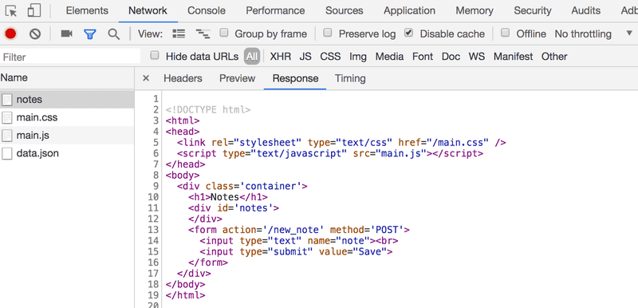

_Cuando comparamos la página mostrada en el navegador y el código HTML devuelto por el servidor, notamos que el codigo no contiene la lista de notas. La sección [head](https://developer.mozilla.org/en-US/docs/Web/HTML/Element/head) contiene un tag [script](https://developer.mozilla.org/en-US/docs/Web/HTML/Element/script), que hace que el navegador recupere un archivo JavaScript llamado main.js._

_El código JavaScript se ve de la siguiente manera:_

~~~
var xhttp = new XMLHttpRequest()

xhttp.onreadystatechange = function() {
  if (this.readyState == 4 && this.status == 200) {
    const data = JSON.parse(this.responseText)
    console.log(data)

    var ul = document.createElement('ul')
    ul.setAttribute('class', 'notes')

    data.forEach(function(note) {
      var li = document.createElement('li')

      ul.appendChild(li)
      li.appendChild(document.createTextNode(note.content))
    })

    document.getElementById('notes').appendChild(ul)
  }
}

xhttp.open('GET', '/data.json', true)
xhttp.send()
~~~

_Los detalles del codigo no son importantes ahora, pero se agregó algo de codigo para darle vida a las imagenes y al texto. En la [parte 1]() se empezará a escribir codigo apropiadamente. El código de ejemplo utilizado en esta parte actualmente no es relevante para las tecnicas de desarrollo de este curso._

>_Algunos podrían perguntarse porque se utiliza el objeto xhttp en lugar del fetch moderno. Esto se debe a que no queremos introducirnos en promesas por el momento, y el código tiene un rol secundario en esta parte. En la [parte 2]() volveremos a la manera moderna de realizar solicitudes al servidor._<

_Inmediatamente después de recuperar el tag **script**, el navegador ejecuta el código._

_Las últimas dos lineas definen que el navegador hace una solicitud HTTP GET a la dirección del servidor /data.json:_

~~~
xhttp.open('GET', '/data.json', true)
xhttp.send()
~~~

_Esta es la solicitud es la mostrada al final de la lista en la pestaña Network._

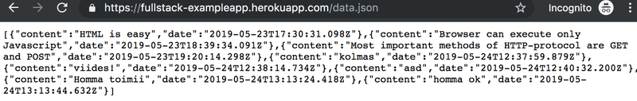

_Acá encontramos las notas en JSON como datos sin procesar. Por defecto, el navegador no es bueno mostrando datos JSON. Se puede utilizar plugins para manejar el formateo. Se puede instalar, por ejemplo, [JSONView](https://chrome.google.com/webstore/detail/jsonview/chklaanhfefbnpoihckbnefhakgolnmc) en Chrome, y al recargar la página, los datos se mostrarán bien formateados:_

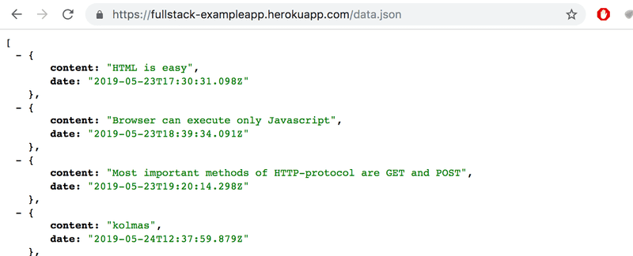

_Así, el código JavaScript de la página anterior de notas descarga los datos JSON que contienen las notas, y genera una lista a partir del contenido de la nota._

_Esto está hecho por el siguiente código:_

~~~
const data = JSON.parse(this.responseText)
console.log(data)

var ul = document.createElement('ul')
ul.setAttribute('class', 'notes')

data.forEach(function(note) {
  var li = document.createElement('li')

  ul.appendChild(li)
  li.appendChild(document.createTextNode(note.content))
})

document.getElementById('notes').appendChild(ul)
~~~

_El código primero crea una lista no ordenada con el tag [ul](https://developer.mozilla.org/en-US/docs/Web/HTML/Element/ul)..._

~~~
var ul = document.createElement('ul')
ul.setAttribute('class', 'notes')
~~~

_...y luego cada nota es agregada a un tag [li](https://developer.mozilla.org/en-US/docs/Web/HTML/Element/li). Solo el valor **content** de cada nota se convierte en el contenido de el tag li. Los datos de las fechas no son utilizados en ningún lugar aquí._

~~~
data.forEach(function(note) {
  var li = document.createElement('li')

  ul.appendChild(li)
  li.appendChild(document.createTextNode(note.content))
})
~~~

_Ahora abrimos la pestaña Console en la consola de desarrollo:_

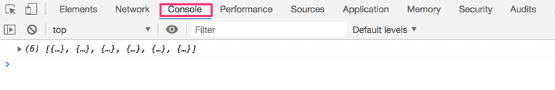

_Clickeando en el pequeño triángulo al comienzo de la linea, se puede expandir el texto en al consola._

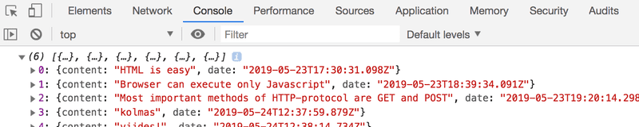

_La salida de la consola es causada por el comando `console.log` en el código:_

~~~
const data = JSON.parse(this.responseText)
console.log(data)
~~~

_Así, cuando se reciben los datos del servidor, el código lo muestra en la consola._

_La pestaña Console y el comando `console.log` se convertiran en algo muy familiar durante el curso._

#### 🔹🔹🔹 Control de eventos y funciones Callback 🔹🔹🔹

_La estructura de este código es un poco extraña:_

~~~
var xhttp = new XMLHttpRequest()

xhttp.onreadystatechange = function() {
  // el código dentro de esta funcion 
  // se encarga de la respuesta del servidor
}

xhttp.open('GET', '/data.json', true)
xhttp.send()
~~~

_La petición al servidor es enviada en la ultima linea, pero el código que maneja la respuesta se encuentra más arriba. Qué está pasando?_

~~~
xhttp.onreadystatechange = function () {
~~~

_En esta linea, un controlador de eventos (event handler) **onreadystatechange** es definido para el objeto `xhttp` haciendo la petición. Cuando el estado del objeto cambia, el navegador llama a la funcion controladora de eventos. El codigo de la función verifica que el [`readyState`](https://developer.mozilla.org/en-US/docs/Web/API/XMLHttpRequest/readyState) sea igual a 4 (que significa que **la operación esta completada**) y que el codigo de estado HTTP (status code) de la respuesta es **200**._

~~~
xhttp.onreadystatechange = function() {
  if (this.readyState == 4 && this.status == 200) {
    // el código dentro de esta funcion 
    // se encarga de la respuesta del servidor
  }
}  
~~~

_Esta forma de llamar a los controladores de eventos en JavaScript es muy común. Las funciones controladoras de eventos (event handler functions) son llamadas funciones de [Callback](https://developer.mozilla.org/en-US/docs/Glossary/Callback_function). El codigo de la aplicación no llama por si mismo a la función, sino que lo hace el entorno de ejecución (runtime enviroment), que en este caso seria el navegador. Asi, cada vez que ocurre el evento, el navegador llama a la función en el momento apropiado._

#### 🔹🔹🔹 DOM o Modelo de Objetos del Documento 🔹🔹🔹

_Podemos pensar a las páginas HTML como estructuras de árbol._

~~~
html
  head
    link
    script
  body
    div
      h1
      div
        ul
          li
          li
          li
      form
        input
        input
~~~

_Esta misma estructura puede verse en la pestaña de la consola **Elements**._

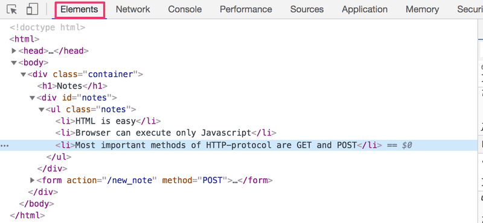

_Asi, el funcionamiento del navegador esta basado en la idea de representar los elementos HTML como un árbol._

_El DOM es una Interfaz de Programación de Aplicaciones (mas conocida como API), que permite la modificación de los elementos del árbol correspondientes a las páginas webs a través de la programación._

_El codigo JavaScript introducido previamente en este capítulo usa la DOM-API para agregar la lista de notas a la página._

_El siguiente código crea un nuevo nodo en la variable `ul`, y agrega algunos nodos hijos a él:_

~~~
var ul = document.createElement('ul')

data.forEach(function(note) {
  var li = document.createElement('li')

  ul.appendChild(li)
  li.appendChild(document.createTextNode(note.content))
})
~~~

_Por último, la rama del árbol de la variable `ul` es colocada en el lugar apropiado en el árbol del HTML de toda la página:_

~~~
document.getElementById('notes').appendChild(ul)
~~~

#### 🔹🔹🔹 Manipulando el Document-Object desde la consola 🔹🔹🔹

_El nodo principal del DOM del cual derivan el resto de nodos en un documento HTML es llamado `document` object (objeto document). Podemos realizar varias operaciones en una pagina web usando la DOM-API. Podemos acceder al objeto `document` desde la pestaña Console:_

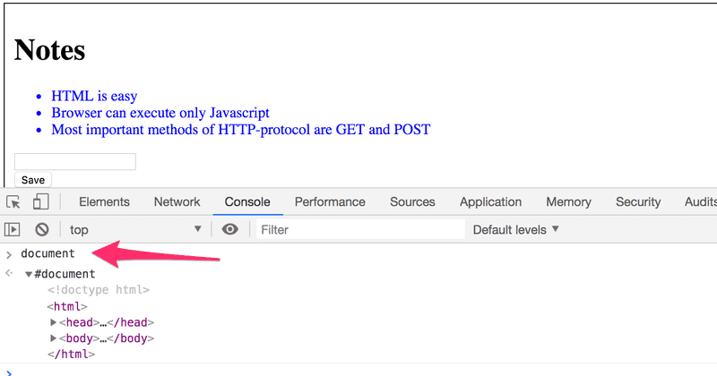

_Vamos a agregar una nueva nota a la página desde la consola._

_Primero debemos obtener la lista de notas de la página. La lista está en el primer elemento `ul` de la página:_

~~~
list = document.getElementsByTagName('ul')[0]
~~~

_Luego creamos un nuevo elemento `li` y le agregamos algun texto con el metodo de elementos `textContent`:_

~~~
newElement = document.createElement('li')
newElement.textContent = 'Page manipulation from console is easy'
~~~

_Y finalmente agregamos el nuevo elemento li a la lista:_

~~~
list.appendChild(newElement)
~~~

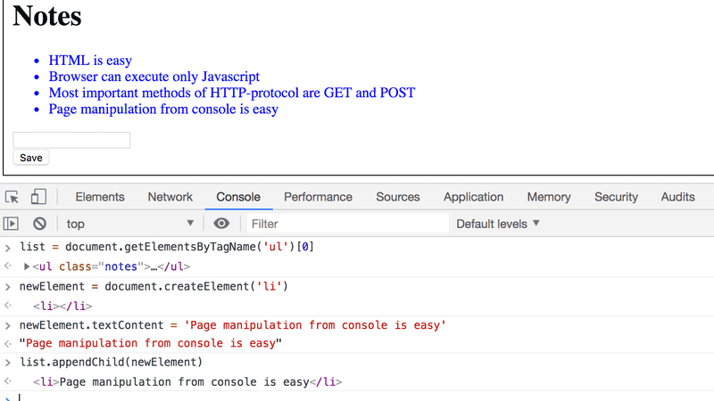

_Hay que aclarar que aunque la página se actualiza en el navegador con el nuevo elemento, el cambio no es permanente. Si la pagina es recargada, la nueva nota que agregamos a través de la consola desaparecerá debido a que los cambios no son hechos en el servidor sino en el navegador._

